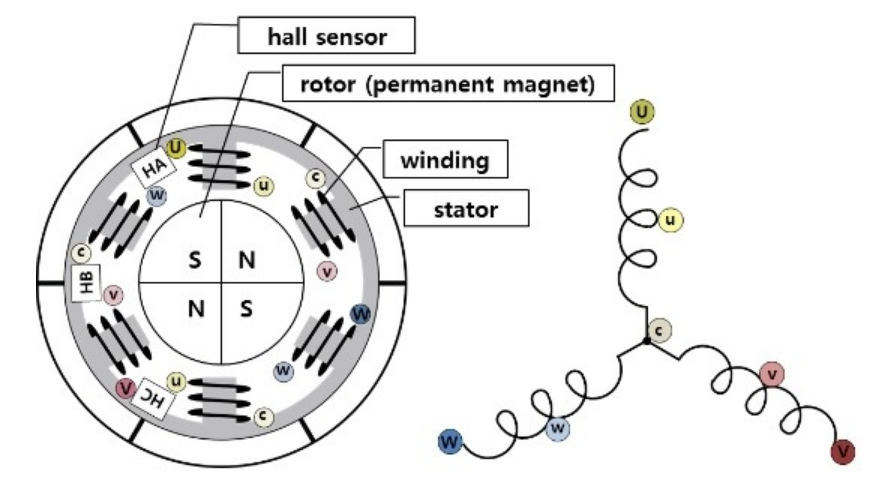
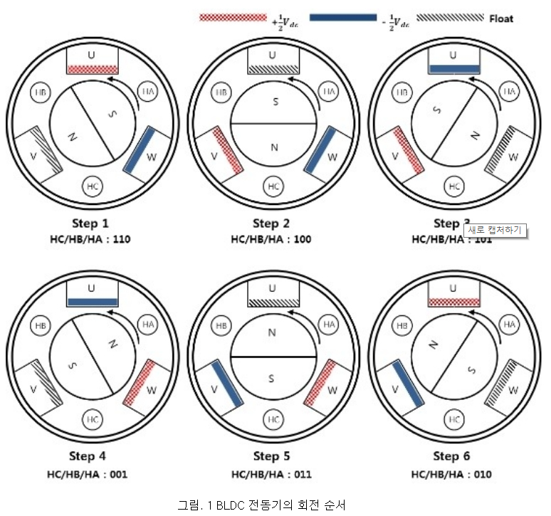

# BLDC Motor

## BLDC 모터의 구조

DC 모터는 브러쉬를 통한 기계적인 접촉 구조이냐 아니냐에 따라 Brushed DC 모터와 Brushed less DC 모터로 구분합니다.

 
 **DC_Motor**</img>
1. Brushed DC 모터는 2개의 전선으로만 구성되어 있다.
  - 장점 : ***전동기를 구동시키기 위한 드라이버의 설계 및 제어가 용이하다
  - 단점 : Brush의 접촉을 통해서 회전에 따라 전기자 전류의 극성이 바뀌게 되므로, ***기계적 소음과 전기적 잡음이 심하며 내구성이 떨어짐.

 
 **Brushed_DC_Motor**</img>
2. BLDC 모터는 Brushr 가 제거된 형태입니다. 위 그림에서 보이듯 BLDC 모터는 가운데 영구자석으로 되어있는 회전자, 고정자의 이빨에 권선이 감겨있는 형태입니다.
   또한, BLDC 모터의 영구자석(회전자)을 회전 시키기 위해서는 영구자석의 위치 및 극성에 따라 회전자에서 정확한 시점과 정확한 방향으로 자속을 발생시켜야 합니다.
   [ 홀센서 - 3개  :  영구자석의 위치를 검출하기 위해 ]
   [ 전선 - 3개    :  3상을 스위칭하여 제어하기 때문에 ]
   

 
** BLDC 모터의 구동 원리
BLDC 전동기를 구동시키기 위해서는 회전자(영구자석)가 회전하도록 영구자석의 위치에 따라 고정자의 권선에 전류를 흘려서 자속을 발생시킬 권선을 순시적으로 바꾸어 주어야 합니다.

 
 **BLDC 전동기의 회전 순서**</img>

