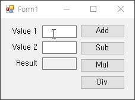

# [.Net] C++/CLI로 C#에서 사용하기 위한 dll 만들기 (예제 포함)

## 들어가기에 앞서, C++/CLI란?
 **C++/CLI를 통해 C++코드를 C#에서 동작시키는 프로세스**</img>

## C++/CLI 예제 만들기
- 간단하게 C++/CLI 프로젝트에서 덧셈, 뺄셈, 곱셈, 나눗셈 함수를 만들어 C#에서 사용하는 계산기를 만들어보겠습니다.
 먼저, Visual Studio 구성으로 C++/CLI가 설치되어 있어야 합니다.
 설치가 되어 있지 않은 경우, 설치 구성에서 'C++/CLI 지원'을 클릭하고 설치하면 됩니다.
  **Visual Studio 설치**</img>
 
  
1. 준비가 되면 'CLR 클래스 라이브러리'를 선택하고 프로젝트를 생성합니다.
 **CLR 클래스 라이브러리 생성**</img>

- 프로젝트 이름 "Wrapper"로 생성.
- 프로젝트가 생성되면 Wrapper.h 및 cpp 파일이 보이고, 헤더 파일을 열어 보면 C# 문법이 보입니다.
- C#은 헤더 파일과 소스 파일이 없는데, C++과 C#이 뒤섞인 느낌.

 
 **C++/CLI 모습**</img>

 
- 이제 Wrapper class에 사칙 연산을 위한 함수들을 헤더에 다음과 같이 정의합니다.
- 클래스 명은 MyArithmetic 으로 정의.

 
 **헤더 파일, Wrapper Class**</img>

 
소스 파일에는 아래처럼 구현합니다.
 **Wrapper 소스파일**</img>

 
### 이렇게 작성한 후, 빌드하면 출력 경로에 dll 파일이 생성됩니다.
### 생성된 dll은 이후 C# 프로젝트에서 사용됩니다.

 
 **생성된 dll 파일**</img>

 
- 이제 솔루션에 C# 프로젝트를 하나 추가해야 합니다. 아래처럼 솔루션에서 '새 프로젝트' 메뉴를 선택합니다.

 **새 프로젝트 추가**</img>

- 아래 그림처럼 "Windows Forms 앱"을 선택하고 프로젝트를 생성합니다.
 **C# 프로젝트 생성**</img>

 
- 프로젝트 생성이 완료되면 솔루션 탐색기에 두 개의 프로젝트가 보입니다.
- C# 프로젝트의 '참조'에서 마우스 오른쪽 버튼을 클릭하고 '참조 추가'를 선택합니다.

 **참조 추가**</img>
그리고 Wrapper 프로젝트의 출력 경로에서 'Wrapper.dll'을 체크하고 추가합니다.

 
 **Wrapper.dll 추가**</img>

- 정상적으로 추가되면 아래처럼 '참조'에 'Wrapper' 항목이 보입니다.

 **Wrapper.dll 추가된 모습**</img>

 
이제 C# 프로젝트에서 MyArithmetic Class를 정의하여 사칙연산 함수를 호출하는 방법을 보겠습니다.
먼저 C# 프로그램의 UI는 아래처럼 구성했습니다.

 **C# 프로그램 UI 레이아웃**</img>

  
- 코드에서는 using Wrapper; 를 추가하고 MyArithmetic 객체를 생성합니다.
- 그리고 각 버튼의 이벤트에서는 사칙연산 함수들을 호출하면 됩니다.
 **소스코드**</img>

 
## 여기서 잠깐!!! 여기서 바로 실행하면  "올바른 Win32 애플리케이션이 아닙니다." 라는 에러가 뜰 것이다.
## 이유는, C#을 시작프로젝트로 설정을 안했기 때문이다.
## 여기서 시간을 꽤나 많이 할애했었다.
## WindowsFormsApp1 우클릭 후, 시작프로젝트로 설정을 클릭하고 실행한다!

 **프로그램 결과**</img>

- MyArithmetic 객체로 사칙연산 함수를 호출한 것이 보이지만, 내부 연산 코드까지는 노출되지 않는다.
- 직접 만든 알고리즘을 C# 함수에 직접 구현하면 큰일나겠죠?
- 그 말은, RAWSim-O도 보이지 않는 곳에서 연산을 한다는 말? -> 찾아보기로 하자. (개인)
