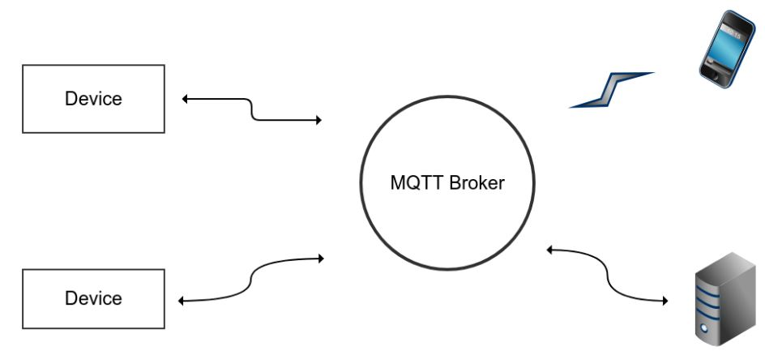

# MQTT란? (Message Queuing Telemetry Transport)  
  : 사물인터넷에 최적화된 프로토콜.  (헤더가 작게는 단 2바이트일 정도로, HTTP와는 비교도 안되게 작다.)  
  : MQTT는 M2M, IoT를 위한 프로토콜로서, 최소한의 전력과 패킷량으로 통신하는 프로토콜입니다.   
  : 따라서, IoT와 모바일 어플리케이션 등의 통신에 매우 적합한 프로토콜입니다.  
  : ISO 표준(ISO/IEC PRF 20922) 발행-구독 기반의 메시징 프로토콜  
  : TCP/IP 프로토콜 위에서 동작.  
  
# MQTT 정리
  *MQTT는 일정한 주제를 놓고, 해당 주제를 서버에 입력해 채팅하는 통신 방식입니다. 그 외에도 여러 특징들이 있습니다.
  -단순하고 가벼운 메시징 프로토콜
  -오버헤드를 최소화 하기 위해 헤더 크기를 대폭 줄이고, Payload 데이터에 중립
  -QoS 지원
  -클라이언트와 서버 간 연결이 끊어졌을 때의 보정 기능 제공
  -TLS/SSL 지원 (X.509를 이용한 양방향 인증 지원)
  -사용자 인증 방식 제공
  -오픈 소스
   
  *MQTT를 도입할 때 가장 크게 고려하는 부분은 "보안"문제 일 것입니다. 
   http, xmpp는 TLS/SSL 등을 사용해 메시지를 암호화 할 수 있는데, MQTT에서도 이를 지원하기 때문에 보안 문제를 고려하고 계신다면, 안심하셔도 됩니다.
   
  *프로토콜 자체가 가벼워서 IoT에 사용하기에 적합합니다.  
  *Raspberry Pi 에 사용되는 리눅스 기반 운영체제에 간단하게 포팅할 수 있고, Windows 에서도 사용이 가능합니다.
  
 
## MQTT 사용 이유
  : 통신 장비, 모바일, 스마트폰 기기에 최적화된 가벼운 메시징 프로토콜로 IoT 장비에 현재 많이 사용되고 있는 프로토콜로서,
    메시징 프로토콜에는 HTTP나 HTTPS를 사용할 수도 있지만, *IoT와 같은 라이트 장비 (스펙이 높지 않은 장비)에 대해서 단순 메시징 교환을 위해 무거운 프로토콜을 사용하게 되면 그만큼 성능 저아학 생기게 됩니다.*

 
### XMPP랑 차이?
  : XMPP 프로토콜의 경우, 메시징 교환으로 적절하지만, 메시지의 크기와 형태가 일반적인 문자열이 아닌 xml 파일 형식으로 주고 받기 때문에 리소스가 크다는 단점이 있습니다.
    그래서 MQTT 를 사용합니다.
  
 
## 특징
  : 통신은 '브로커'라고 불리는 서버에 의해 중계
    클라이언트들은 임의의 '토픽'을 '구독(subscribe)'하거나 토픽에 메시지를 '게시(publish)'하는 식으로 상호간에 통신
  : 어느 한 클라이언트가 메시지(payload)를 퍼블리싱 하면 브로커(서버)는 해당 토픽을 구독중인 클라이언트들에게 메시지를 보낸다.
    이는 마치 인터넷 게시판이나 RSS 피드의 작동 방식과 비슷한데, 이러한 구조와 단순하고 가벼운 프로토콜 덕분에 IoT 개념을 탑재한 수많은 기기들 간의 유연한 통신이 가능할 것으로 기대.
  
- MQTT는 HTTP, TCP 등의 통신과 같이 클라이언트-서버 구조로 이루어지는 것이 아닌
  Broker, Publisher, Subscriber 구조로 이루어집니다.
  
 **Broker, Publisher**</img>

 
Publisher : Topic 을 발행(publish) 하고,
Subscriber : Topic 에 구독(subscribe) 합니다.
Broker : Publisher와 Subscriber 둘을 중계하는 역할을 하며, 단일 Topic 에 여러 Subscribere 가 구독할 수 있기 때문에, 1:N 통신 구축에도 매우 유용합니다.

 
MQTT에서 Topic은 /를 사용해서 구성되기 때문에,

 
 
 **MQTT Topic의 / 구성**</img>

위와 같이 계층을 구성한다면, IoT 센서와 같은 데이터를 관리하기에 매우 용이합니다.
-MQTT는 QoS(Quality of Service)를 제공하는데, 총 3단계로 나뉘어져 있습니다.
* 0 : (최대 한 차례) - 메시지는 한 번만 전달되며, 전달이후의 수신과정을 체크하지 않는다.  (보낸 다음 잊어버림)
* 1 : (최소 한 차례) - 메시지는 한 번 이상 전달되고, 핸드셰이킹 과정을 추적하나, 엄격하게 추적하지 않기 때문에 중복수신의 가능성이 있다.  (확인 응답을 거치는 전달)
* 2 : (정확히 한 번) - 메시지는 한 번만 전달되고, 핸드셰이킹의 모든 과정을 체크한다.  (보장된 전달)

 
이 필드는 기반이 되는 TCP 데이터 전송의 처리에 영향을 주지 않으며, MQTT 송신자와 수신자 간에만 사용된다.

 
QoS의 단계가 높아질수록 통신의 품질은 향상되지만, 그에 따라 성능 저하의 가능성이 있으므로 QoS는 프로젝트의 특성에 따라 결정되어야 합니다.

 
## MQTT 브로커 구동하기
  : MQTT 프로토콜을 구현하는 브로커들은 아래와 같이 여러 것들이 있습니다.  
    * Mosquitto  
    * HiveMQ  
    * mosca  
    * ActiveMQ  
    * RabbitMQ (Plug-in 형태로 지원)  
    
그 중에서도 유명한 브로커 중 하나인 Mosquitto 를 사용해보도록 하겠습니다.
=====================================================================================================================================
 
## MQTT (MQ Telemetry Transport) 
:MQTT는 Broker Pattern을 채택하여 개발된 경량형 메시징 프로토콜로, 1999년 IBM, Eurotech에서 개발하였다가 현재 IBM에서 버전 3.11까지 내놓았습니다.
 
Broker Pattern을 사용한다는 것은 HTTP, XMPP와 같이 Client-Server Model을 수용하지만, 약간 다릅니다. 
보통 메시지 교환 프로토콜은 클라이언트가 전달할 메시지를 서버에게 주고, 서버는 누가, 누구에게 어떤 메시지를 줄 것인지를 전달 받아, 서버가 클라이언트에게 전송하는 방식입니다.
 
하지만 Broker Pattern 은 Broker 라는 중계자가 중계 서버 등으로 존재하고, 해당 서버에서 Topic(주제)를 선정하고, 해당 Topic 의 구독자들에게 메시지를 전달해주는 방식입니다.

 
 **Broker Pattern**</img>

Broker Pattern을 간단히 그림으로 설명.
스마트폰에서 어떤 데이터를 애플리케이션 서버에게 주려고 합니다. 그러면 스마트폰에서는 브로커에게 Topic를 던져주고, 메시지를 남깁니다.
애플리케이션 서버는 스마트폰이 만들어 놓은 Topic 을 구독하여 메시지가 올 때마다 수신하는 것입니다.
 
같은 방법으로, 왼쪽에 있는 Sensor Device 들도 자신들의 TOpic을 만들고, 해당 Topic에 메시지를 보냅니다. 그러면 구독하고 있는 애플리케이션 서버는 해당 메시지를 받아 처리하는 것이지요.
 
이렇게 하면, 1:1뿐만 아니라, 1:N, N:N 통신도 쉽게 구현이 가능합니다. 원하는 사용자가 해당 Topic을 구독(Subscribe)하여 메시지를 받고, 그에 대응하는 메시지를 발행(Publish) 할 수 있기 때문이죠. 일반적인 채팅 서버를 만드는 것에 비하면 굉장히 리소스를 덜 필요로 한다는 것이 특징입니다.

 
 
## MQTT Broker
 :MQTT를 사용하려면, 메시지를 보내는 사람과 받는 사람이 있고, 그 다음 메시지를 중계해 줄 Broker가 필요합니다.  
 :MQTT Broker에는 여러가지가 존재합니다.
 

### MQTT Broker list   
  : * Mosquitto    * HiveMQ    * mosca    * ActiveMQ    * RabbitMQ (Plug-in 형태로 지원)    *Paho 등 여러가지가 존재합니다.  
  : Mosquitto를 많이 사용합니다.  
    ->가장 많은 언어를 지원하고, 여러가지 제약은 아직 존재하지만, MQTT를 통신하는 데 있어 가장 무난합니다.
    ->실제 Facebook 에서도 Broker로 Mosquitto 를 채택해 사용 중입니다. (Facebook Messenger)
    
   
## MQTT 를 알아보며..
- MQTT에 대해 알아봤습니다. 프로토콜 자체는 그렇게 어려운 프로토콜이 아닙니다. 다만 최근에는 메시지 교환 프로토콜이 널리 쓰이고 있습니다.
  위에서 얘기한 채팅 뿐만 아니라 센서들 간의 메시지 교환, Push 알림 등이 존재합니다. Push 알림도 서버를 사용한다면, 쉽게 구현할 수 있지만, 센서들 간의 메시지 교환에는 전력 한계와 성능 한계치가 존재합니다. 전력을 많이 소모하게 될 경우, IoT 장비에서 불리해지기 때문이지요.
- 만약 이런 문제를 고려하고 계신다면, MQTT 프로토콜 사용을 한 번 권해봅니다.

 
 

### 로봇 통신에 관련해서 사용하려는 계획??
